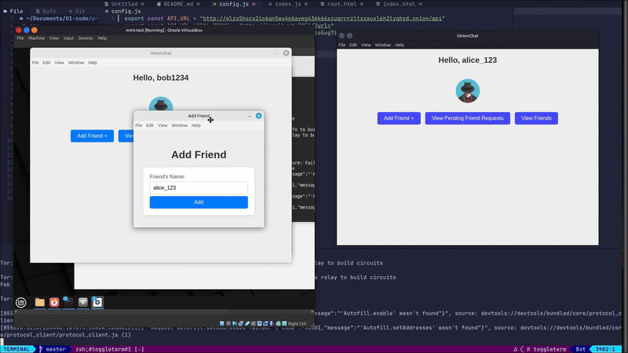
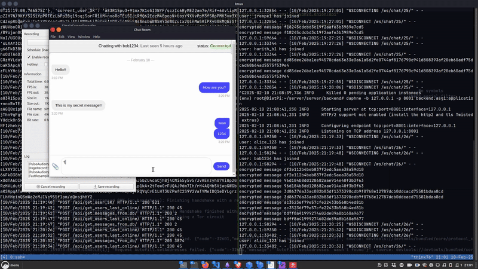

# OnionChat

A secure, end-to-end encrypted chat application designed to prioritize privacy, with Tor integration to further enhance anonymity. Currently **only available for Debian Linux (.deb) and Red Hat (.rpm)**

## About

OnionChat is a secure messaging app that uses asymmetric and symmetric cryptography  for private communications. It ensures message confidentiality and integrity between users and Tor routing to provide an additional layer of anonymity. This feature is ideal for users who need added privacy in their communications

## Features

- **End-to-End Encryption**: Messages are encrypted on the sender's device and only decrypted on the recipient's, ensuring secure communications.
- **Tor Network Routing** : All messages and API requests are routed through the Tor network for anonymity and additional privacy.
- **Public/Private Key Exchange**: Users exchange public keys for secure, encrypted message delivery.
- **File uploads**: Provides secure & encrypted file uploads.
- **Persistent Encrypted Messages**: Messages are stored on the server in encrypted form, accessible only to authorized users.
- **Kill switch**: If for any reason Tor service stops running, no further data will be able to be sent and the app will automatically close.

### Preview

---

## Languages/frameworks used

- Electron JS 
- Django REST API

## How to compile & run

1. `npm install`
2. `npm run make`
3. view executable at "out/make/deb" or "out/make/rpm" 

## Prerquisets
- NodeJS & npm
- Make sure you have tor installed
    - For Debian: `sudo apt install tor`
    - Turn off Tor: `sudo systemctl disable tor` -- It will be ran by the application (we don't want it to already be ran)

## Blog post
- Here is a deep dive on this project here: 

## Server

https://github.com/harithh0/OnionChat-server

## Please Note
- Server will may not be on all the time.
- You can host your own server by visiting the server source code above
